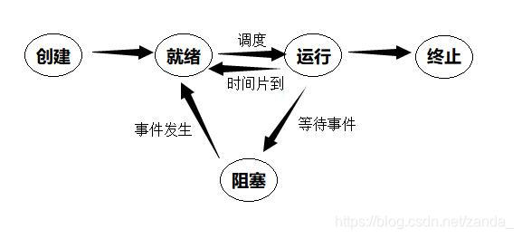

# 操作系统OS2026
## 第一章 Introduction
- 操作系统的定义：资源分配器/应用程序；
### 中断
- 非屏蔽中断／屏蔽中断
- 中断链，中断优先级
### 存储结构
- 主存=RAM, 一般用DRAM, 易失性
- 外存=硬盘驱动器(HDD)+非易失性存储器(NVM)
- DMA: 主存和外存间直接传输数据, 不需要经过CPU, 更不需要中途不断中断
### 双模式
- 内核模式=系统模式=监视模式=特权模式
- 用户模式
- 模式位: 0=kernel, 1=user
- 特权指令: 可能损害机器, 只有在kernel mode下才可以运行
## 第二章 操作系统结构 OS Structure
### 系统调用 System Call
- 用户界面 包含 图形用户界面(GUI)/命令行(CLI)
- API
- RTE运行时环境
- 进程控制
  - lock: acquire和release
- 源文件--编译器-->.elf文件--链接器-->二进制源码--加载器-->内存
- 通信 分为 共享内存/消息交换
  - 消息传递: 通信源:client, server, 可接受连接的进程称为daemon
  - 共享内存: 交换数据由进程决定而不是操作系统决定
  - 优缺点: 消息传递不需要避免冲突, 共享内存高速便捷
### 操作系统的结构
|内核类型|例子|优点|缺点
|---|---|---|---|
|简单结构/单片(monolithic) | UNIX, Linux| 效率高|实现和扩展难
|分层法 | Webapp| 模块化, 层之间交互问题少|整体性能差.
|微内核(microkernel) |苹果| 便于扩展, 服务被剥离出去导致内核本身安全 | 性能受损

\*LKM=Loadable Kernel Module: 对简单结构的扩展, 用于几乎所有现代简单结构内核; 集百家之长, 类似分层法但每个模块地位都平等, 类似微内核但采用加载而不用消息传递.
实际上大部分现代系统都是混合型的
### 操作系统构建与调试
- 引导块中存放BIOS(小型引导加载程序)或UEFI, 引导出剩下的引导程序(类似引导伞)
- debug: 处理bug以提升性能.
- 内核故障就是崩溃(crush), log file存放.
### "机制与策略的分离"
- 典型例子: 某某替换机制 与 FIFO/LRU策略的分离
- 优点: 底层稳定, 上层灵活.

## 第三章 进程 Process
### 概念
- 五状态:
  new, ready, running, waiting(阻塞), terminated
  状态转换图: 
  
- PCB(Process Control Block): 例子, 包含了进程状态, program counter, CPU寄存器 等

### 调度
- I/O密集型和CPU密集型, 例子: 聊天软件是IO密集型, 视频编辑器是CPU密集型
- 队列图, 包含了就绪队列和等待队列两种, 每种也都可以有多条
  例如, 发出I/O请求, 从就绪队列转移到I/O队列; 发生中断, 又被放回到就绪队列
- 交换: 进程在内存与磁盘之间的转换以释放内存空间, 详见Chap.9
- 上下文切换: 状态保存, 状态恢复. 保存就存在PCB中.
### 操作
- 进程创建: 每个进程都有唯一的pid, 创建子进程逐渐链接成了进程树
  - fork(): 子进程复制父进程的大部分信息, 唯一区别是pid不同且父进程调用fork返回子进程pid, 子进程调用fork返回0. 此时两进程并发执行
  - exec(): 加载到内存中
  - wait()
  - 必背典型案例:
  ```c
  /*UNIX*/
  pid=fork();//由于fork时复制大部分信息, 子进程也从这里继续执行!!!
  if(pid < 0){
      //error
  }
  else if (pid == 0) //子进程
      exec();
  else //父进程
      wait();
  ```
- 进程终止
  - exit(1); 传递信息给内核
  - pid = wait(&status); 其中status由内核负责改变, 这样在醒来后能立刻同步信息
  - 僵尸进程: 自己终止, 父进程暂时没有wait(), 解决方式: 立刻wait或者变成孤儿进程
  - 孤儿进程: 父进程还没有调用wait就终止了, 解决方法: 由init"领养"
  - 有些系统有级联终止处理, 避免了孤儿进程的现象
### 进程间通信=IPC (详细展开)

- 共享内存系统: 生产者-消费者模型;
  有一个buffer, 可以是有界的或者无界的
  有界缓冲区问题:
  - buffer为空, 则消费者要等待
  - buffer为满, 则生产者要等待

- 消息传递系统: 发送方与接收方;
  - 直接通信: Psend(Q, mes), Qreceive(P,mes), 拥有对称性
  - 非对称性: Q不指定发送方, 只填进程id
  - 间接通信: 邮箱A, Psend(A), Qreceive(A)
  - 阻塞(同步)/非阻塞(异步), 发送方接收方共有4种组合, 其中阻塞发送阻塞接受就没有生产者-消费者问题;
    - 根据buffer的容量不同, 决定具体的方案.

### IPC系统实例
- POSIX: 共享内存实例
- Mach: 消息通信实例, 发给port
- Windows: ALPC, 包含连接端口和通信端口, 由RPC改造
- 管道Pipe
  - 普通(匿名)管道: 单向通信, 要实现双向则要造两条, 只有两个进程互相通信时才存在, 即用即搭, 用完即拆. 
  - 命名管道: 例如open, read等函数, 双向的

## 第四章 线程与并发 Thread and Synchronization
### 概念
- 一个进程包含多个线程
  进程: OS资源(例如内存空间, pid等)分配的基本单位
  线程: CPU调度的基本单位, 只有tid, 寄存器, pc, 和一点栈, 其他资源全部共享
- 多线程的优点: 一个线程阻塞了整个进程还能继续运行, 共享资源, 在多核CPU更加显著
- Amdahl定律: 加速比$\le \frac{1}{S+\frac{1-S}{N}}$, S为串行占比, 1-S为并行占比, N为核数
- 数据并行, 例如加法每一位同步加
- 任务并行, 顾名思义
- 多对一, 一对一, 多对多模型: 用户线程到内核线程的映射.
- 同步/异步线程: 同步对应类似进程中, 父进程必须wait
### 实例
- 隐式线程(Implicit Threading)
  - 线程池, 不用程序员自己创建, 抓一只就过来用, 也不用担心超出数量限制
  - fork-join模型
  - OpenMP, GCD(苹果的)...
- 线程撤销
- 用户与内核线程之间增加轻量级进程(LWP), 用于动态调整当前线程的数量

## 第五章 CPU调度 (※)
- burst(突发): 具有长尾分布特征, 有大量短突发和少量长突发
- 抢占式与非抢占式调度: 一个进程就绪时能不能被打断
- 分派程序(dispatcher), 包括切换context, 切换到user mode, 跳到对应的PC, 是具体的执行者, 而调度程序只负责规划
### 调度准则
对以下几个概念具体是什么要熟悉
- CPU利用率
- 吞吐量(每秒几个进程)
- 周转时间(一个进程从提交到完成的时间, 包括了等待排队时间)
- 响应时间(第一次产生输出的时间)
  非抢占式调度下, 响应时间就是等待时间.
  抢占式调度下案例: A等待10ms, 运行5ms, 被B抢过去又等待10ms, 运行5ms. 则周转时间30ms, 等待时间20ms, 响应时间10ms. 可以看出一定有响应时间$\le$等待时间.
### 调度算法/甘特图
- FCFS
- SJF(Shortest Job First)
  理论最优(平均等待时间最短), 但无法实现, 因为没法一开始就知道所有burst的信息然后排序;
  近似调度公式: 其中$\tau$是预测下一个burst的长度, 根据接收到"最新的"burst时长信息不断修正. 原理是因为局部性我们认为burst的时长应该是接近的
  $$\tau_{n+1}=\alpha t_n + (1-\alpha)\tau_n$$
  可以抢占也可以非抢占. 如果要抢占, 那么就被称为:
  - 最短剩余时间优先算法(SRTF), 在所有已知线程中, 优先执行剩余时间最短的. 例如A共10ms已经执行了一半, 但来了个B一共2ms, 那么打断A先处理B.
- RR轮询
  每隔一定间隔, 不管当前有没有完成, 强制切换到下一个. ("间隔"的专业名是时间配额或时间片time quantum/slice)
  - 除非当前已经是唯一的进程
  - 或者计时器没到就完成了, 那么直接切换并**重置计时器**;
  - 不能太大, 否则就和FCFS没区别了;
  - 也不能太小, 否则一直切换总效率太低;
  - 保持合理的切换间隔可以保证出现个别超长burst时, 保证短burst以一个可以接受的效率被完成.
- 优先级调度
  也可以是抢占的或者非抢占的;
  - 饥饿问题: 线程优先级太低, 导致永远排不到;
  - 老化处理: 排的越久, 优先级逐步提升;
  - 轮询处理: 相同优先级的请求间进行轮询

  注意到SJF就是一种优先级特例, 而FCFS一定不会有饥饿问题(等得久不算饥饿, 总会等到的)
- 多级队列调度, 很复杂. 
- 多级反馈队列调度, 特别特别复杂, 允许进程在队列之间迁移
- 考试计算题: **注意题目要求的评判指标!**
### 其他复杂情况?
- 多处理器调度: 对称多处理(SMP, Symmetric MultiProcessing), 保证不要某个核拥挤有的核还空着, 对应有推处理(关注满的核)和拉处理(关注空的核)
- 硬件超线程(CMT, Chip MultiThreading), 物理上直接换一套CPU
- 实时CPU调度: 
  - 事件延迟主要含有中断延迟(顾名思义)和调度延迟(从Scheduler完成安排到Dispatcher执行完毕)
  - 软实时vs硬实时: 进程过了截止时间会怎么样? 是直接崩溃还是质量下降?

## 第六章+第七章 同步 (※)
### 问题概述
多个进程修改同一片内存, 如何保证结果确定?
- **三前提**: 互斥, 进步, 有限等待;
  其中进步的解释: 临界区空且有进程在排队时一定要**尽快**决定哪个进去, 不能"三个和尚没水喝".

### 工具
1. 原子变量: 例如compare_and_swap()简称CAS, 优先级最高, 比中断还要高!
2. 互斥锁(mutex lock): 一个bool型变量, 只有acquire()和release()两条指令
  自旋锁: 请求的那个锁没开的时候不断请求直到开门. 没有context switch开销; 缺点: CPU压力大.
3. 信号量(Semaphore)
  实现上, 就是一个int变量, 有且仅有两条原子指令:
  ```c
  wait(S) {
    while (S <= 0)
        ; // 忙等待（或者是阻塞当前进程入队）
    S--;
  }
  signal(S) 
      S++;
  ```
  二进制信号量就等于互斥锁, 此外还有计数信号量. 
  注: wait=S=down, signal=V=up
4. 管程(Monitor)
  高级封装结构, 天然实现互斥. 名字有点抽象可以理解为"资源托管所", 形式上作为一个函数, 自动在开头down结尾up.
### 问题
- 死锁(Deadlock): 两个进程(或者更多)互相请求被对方锁住的锁, 导致无法解开. 通常我们会尽量防止死锁发生而不是研究怎么解开死锁. 
  解决方式? 这一部分非常复杂, 详见第八章.
- 优先级翻转: 高优先级的进程H想要访问内核数据, 但现在正在被一个低优先级的进程L锁住. 如果按照调度规则, 那么H就被L锁住了, 反而L要有更高的优先级.
  解决方式? 临时提升L的优先级, 让他先把锁解了
- 生产者-消费者问题的代码实现: *思考一下是否需要全局指示buffer状态的计数器?*
```c
typedef semaphore int;
semaphore mutex=1;
semaphore empty=N;
semaphore full=0; //注意这俩计数和实际是相反的

void producer{
    int item;
    while(1) {
        item = produce();//生产一个数据
        down(&empty); //判断是否满
        down(&mutex);
        insert(item);//写入队列
        up(&mutex);
        up(&full);
    }
}

void consumer{
    int item;
    while(1) {
        down(&full); //判断是否空
        down(&mutex);
        item = remove();//提取数据
        up(&mutex);
        up(&empty);
        consume(item);
    }
}
```
- 读者-写者问题: 允许多个读者同时读, 但只能有一个写者在写. 对应要采用写优先
  对应的代码实现: 见[附录](#附录)
  三种情况:
  - 读优先: 设置一个reader_count, 但容易导致写者饥饿
  - 读写同优先级: 读优先基础上, 外面各套一层rw锁.
  - 写优先: 读优先基础上, 设置一个writer_count, 但容易导致读者饥饿. 
  - 这几个count要对于"第一个"和"最后一个"进行特殊处理
  
## 第八章 死锁 Deadlock
### 死锁特点:
- 四个条件同时成立:
  - 互斥
  - 占有并等待
  - 非抢占
  - 循环等待
- 资源分配图: 
  - 线程节点, T, 圆圈
  - 资源节点, R, 方块
  - T-R是申请边
  - R-T是分配边
  - 有环是出现了死锁的必要条件. 在每类资源都只有一个时是充要条件.
### 死锁的处理
- 预防: 很显然, 我们会尝试打破这四个条件;
  - 互斥? 互斥锁就那么定义的, 很难改
  - 占有并等待? 直接把资源全都分配好在执行, 会浪费资源
  - 非抢占? 有些资源就是不好抢占
  - 循环等待? 这个可以. 给资源编号, 规定必须按照顺序不能反过来申请.
- 避免: 着重讲银行家算法.
  每个线程都有多个资源的Allocation(已占用), Need(还需要)数据. 可能Need不会直接提供需要通过Max-Allocation简要计算.
  实时更新Available数组, 统计每种资源. 依次比较每个线程得到哪些是阻塞那些可以分配
  显然可能有不止一种解法
  也有可能没有解法. 这时我们称现在的状态是**不安全的**.
- 检测: 
  将资源图只留线程节点, 很容易看出来有没有环, 随后根据一定方法处理
- 鸵鸟:
  实际上是最常见的方法, 发生死锁时什么也不做, 大不了重启.

## 第九章 内存 Memory (※)
- 地址绑定的三个时机?
  - 编译时
  - 加载时
  - 运行时(现代主流)
- 逻辑地址vs物理地址. MMU: 内存管理单元, 负责翻译
### 内存分配
- 连续分配(早期)
  - first-fit: 速度最快
  - best-fit: 产生小碎片
  - worst-fit: 产生大碎片
  - 碎片问题怎么办? 容易想到把碎片凑到一起进行压缩, 但移动内存并不总是好搞的.
- 分页法 
  - page number + offset
  - 对逻辑内存分页, 对物理内存分帧(frame)
  - 没有外部碎片. 仍然有内部碎片
  - TLB: 有效访存时间(EAT)学会计算
- 页表的变种
  - 多级页表
  - 哈希页表
  - 倒置页表

## 第十章 虚拟内存 (※)
- 优点: 空间大大扩大, CPU利用率提高......
### 优化算法
- Demand Paging
  - 仅当发生page fault(对应物理帧不在内存中)时才加载到内存
  - 有一个标志位, 0代表不在内存中
  - 辅助存储器: 保存不在主存中的页面
  - 同样可计算EAT
- COW(Copy-on-Write)
  - 设计原因: fork时子进程并没有立刻被使用, 此时两者信息完全一致
  - 具体执行: 打一个标记, 设置为只读, 随后有一方写时真正分支
### 页面置换算法 
- FIFO: 会导致Belady异常(给进程分配的帧数增加时, 反而更多次置换), 原因是命中时不会调整内部顺序
- OPT(最优): 未来最久不会被使用. 显然这类似SJF只是一个理论解不可能实现
- LRU(Less Recently Use), 不过仍然只能近似达到, 否则开销太大
- 抖动(Thrashing): 频繁换页导致换页时间比运行时间还要长
  - 理论解决方式: 引入工作集模型
  - 实际上, 大部分系统都会尽量扩大内存, 解决不了就算了

**注意: 这算法计算题看起来很简单, 但真算的话非常容易算错, 一定要多检查几遍!!!**

## 第十一章 大容量存储
### 硬盘物理结构
- 一个盘划分为若干圆形磁道(track)
- 磁道内按角度划分为扇区(sector)
- 磁盘有很多层, 所有层同一个位置的track统称为一个柱面
- RPM: 每分钟转速.
- 定位时间=寻道时间+旋转延迟, 可能考计算

NVM:
- 包含SSD(固态), DRAM和USB等
- 没有旋转磁头, 不需要考虑定位时间, 所以直接用FIFO就可以
### 调度算法
- FCFS/FIFO
- SCAN: 从左到右来回扫描
- C-SCAN: 到头时直接返回最开头, 可以缩短平均等待时间
- LOOK/C-LOOK: 不用到头, 到最后一个请求就折返
- SSTF: 距离最短的. 

注意这里是对柱面的调度, 并不是一直旋转的扇区, 所以0和4999之间不能直接转过去.

### RAID校验
|级别|核心技术|带来的优势
|---|---|---
|RAID0|无校验
|RAID1|简单拷贝
|...|...|...
|RAID4|块校验|读并行
|RAID5|分布式奇偶校验|不再依赖一块关键盘,写并行,可以坏一块盘
|RAID6|P+Q校验|可以坏两块盘

## 第十二章 I/O
### 设备名称
- port端口
- bus总线
- controller控制器, 由data-in, data-out, status, control四类寄存器实现
### 机制
- 轮询(polling): 主机一直处于等待和执行的循环
- 中断: 设备主动通知CPU, 也不止是IO在用
  - 非屏蔽式用于I/O, 屏蔽式请求线用于内部报错
- DMA
### 内核子系统
- I/O调度
- 缓冲(Buffer) 目的:
  - 应对速度不匹配
  - 应对传输大小不匹配
  - 防止被修改
- 高速缓存(Cache)
  - 计组学了很多了
- 假脱机(Spooling)
  - 例如打印类设备不能同时处理多请求, 所以要提供一个排队空间

## 第十三到十五章 文件系统
### 抽象结构
- 文件的属性(这一部分在后面具体实现会详细展开)
- 文件操作: 创建, 打开, 写, 读, 删除...
  - 打开文件表(Open File Table)有系统级(记录文件被多少个线程打开)和线程级(记录当前在什么位置等)
- 目录结构: 理解这个演进过程
  - 单级目录-多级(树状)目录-无环有向图-通用图
  - 从树到图: 链接(link), 包含硬链接和符号链接(在[inode具体实现](#inode)会详细展开)
- 访问控制: Access-Control List
### 具体实现
- 直接分配
- 链接分配
- 索引分配, 这里可能会考察文件大小上限
```
---
元数据
直接块->数据地址
直接块
直接块
一级间接块->块地址->数据
二级间接块...
---
```
### 案例解析之FAT
- 簇(cluster)包含多个物理扇区
- 表格项(entry)与簇一一对应
- 磁盘分区开头留一片区域给FAT表
- 数字意义: 例如FAT16代表表中最多有2^16个簇
- 目录项结构:
  - 0字节是文件名第一个字节, 置空时表示文件为空
  - 1-7字节文件名剩下
  - 8-10扩展名
  - ...其他信息
  - FAT表中的编号
  - 28-31文件大小, 所以文件大小理论上限并不是2^16^ * 簇大小而是2^16^-1bits=4GB-1
- 文件名太长怎么办? LFN技术
- 查找过程: 首先通过文件名, 一级一级在目录树中查找到对应的**目录项**, 然后在FAT表中查找对应起始簇号的地址, 当标识符不是EOF时不断查找下一个簇号.
- 删除操作: 第一个字节删掉就行, 还可以恢复

### 案例解析之EXT3
- 块组内格式固定:
  1. Superblock记录整个系统元数据
  2. GDT记录本块组每个部分起始位置
  3. Block&Inode Bitmap记录空闲
  4. inode table
  5. 数据块
- inode内部结构:
  - 元数据 **(注意不包括文件名!)**
  - 12个直接块
  - 各1个一级二级三级间接块
  - 这么设计的好处: 兼容大小文件
- 那么文件名在哪里呢? 目录项中仅有文件名和inode等少量数据, 不用打开就能查找, 而且和FAT的目录项相比更简洁;
- 文件名-inode可以是多对一的映射, 意味着天然支持硬链接;
- 而符号链接的是特殊类型的inode, 数据块中只存放了路径
具体示例:<a id="inode"></a>
```
我们有
/src/file
/src/hardlink
/src/softlink

src的数据块: txt->10, hardlink->10, softlink->20
10对应的数据块: hello
20对应的数据块: /src/file
```

<a id="附录"></a>
## 附录?
有待未来补充